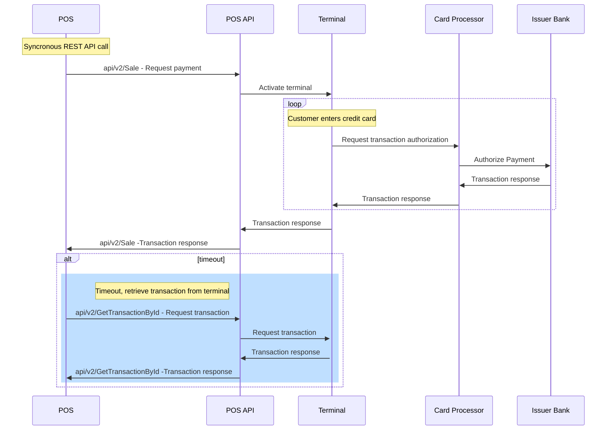

# POS Connectivity Flow

All transactions from the POS system connect to the POS Manager server, which controls centralized device communication. Direct terminal communication is available depending on each customer scenario.

## Flow

 
